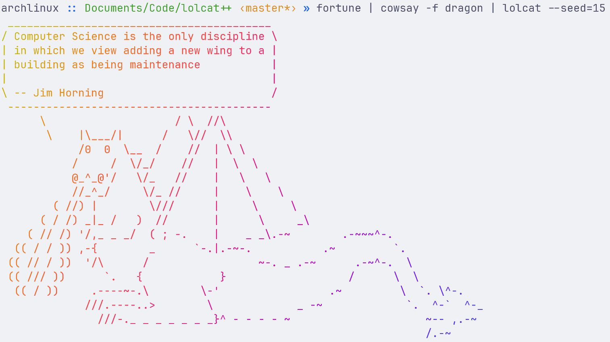

<div align="center">
    
</div>

# Lolcat++

A rewrite of the popular utility [_LOLCAT_](https://github.com/busyloop/lolcat) in C++.
The rationale is that lolcat is often used in init scripts and such.
It can at times be rather time-consuming to run it, since it's written in Ruby.
Now it's -- naturally -- _BLAZINGLY FAST_ in C++.
I'ts also cross-platform.

## Example usage

I've found that `fortune` + `cowsay` + `lolcat` is an impeccable combo.

<div align="center">
    
</div>

## Getting it

Just head over to the [releases](https://github.com/lolcatpp/lolcatpp/releases) and download it.
Here's some copy-paste scripts for your platform:

### Linux

```bash
curl -L \
    https://github.com/lolcatpp/lolcatpp/releases/latest/download/lolcat-linux-amd64 \
    -o /tmp/lolcat
chmod +x /tmp/lolcat
sudo mv -v /tmp/lolcat /usr/local/bin/lolcat
```

### macOS (Apple Silicon)

```bash
curl -L \
    https://github.com/lolcatpp/lolcatpp/releases/latest/download/lolcat-macos-arm64 \
    -o /tmp/lolcat
chmod +x /tmp/lolcat
sudo mv -v /tmp/lolcat /usr/local/bin/lolcat
```

### Windows (Administrator PowerShell)

```powershell
Invoke-WebRequest `
    -Uri "https://github.com/lolcatpp/lolcatpp/releases/latest/download/lolcat-windows-amd64.exe" `
    -OutFile "$env:TEMP\lolcat.exe"

# Move the file to the install directory
$installDir = "C:\Program Files\lolcat++"
New-Item -ItemType Directory -Force -Path $installDir | Out-Null
Move-Item -Force "$env:TEMP\lolcat.exe" "$installDir\lolcat.exe"

# Update the $PATH variable, so that it can be used as "lolcat" in the shell
$currentPath = [System.Environment]::GetEnvironmentVariable("Path", "Machine")
if ($currentPath -notlike "*$installDir*") {
    [System.Environment]::SetEnvironmentVariable("Path", $currentPath + ";$installDir", "Machine")
    Write-Host "Installation complete! Please restart your terminal."
}
```

### Building

You'll need _cmake_, boost's _program_options_, and a C++ 20 compatible compiler.
If your compiler supports C++ 20, but doesn't support `<format>`, then you'll also need
_libfmt_ (it's used as a polyfill).
Thereafter, just run

```bash
cmake -S . -B build && cmake --build build --parallel
```

You'll now have the executable in `build/lolcat`

If you'd like to install the program, just run

```bash
cmake --install build
```

## Acknowledgement

Both the project and the codebase are heavily inspired by the [_LOLCAT_](https://github.com/busyloop/lolcat) project.
