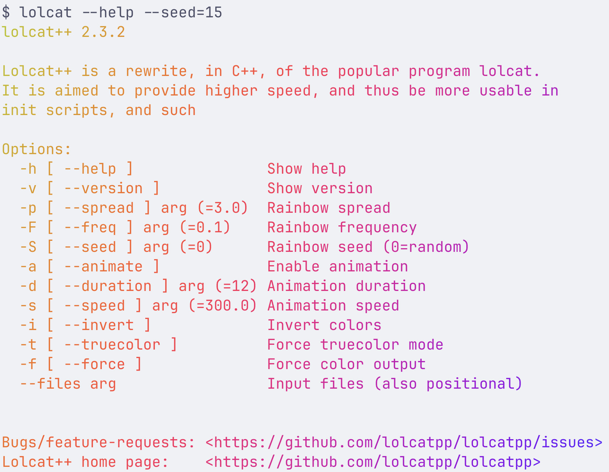
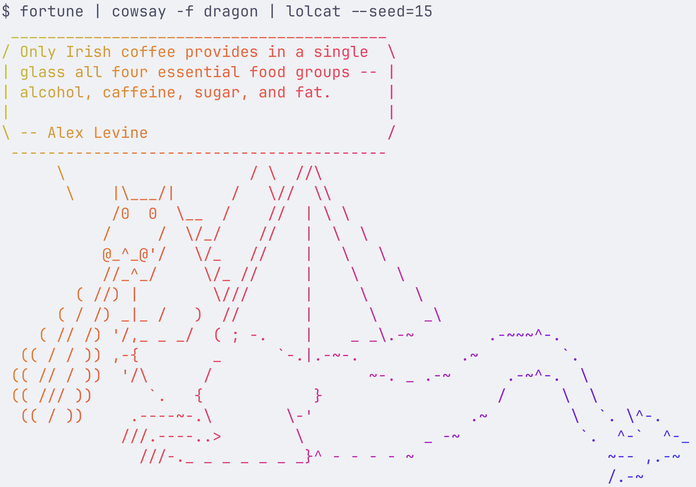

<div align="center">
    
</div>

# Lolcat++

[]()
[](/LICENSE)
[]()
[](https://github.com/lolcatpp/lolcatpp/actions)
[](https://github.com/lolcatpp/lolcatpp/releases/latest)
[](https://aur.archlinux.org/packages/lolcat++)

A rewrite of the popular utility [_LOLCAT_](https://github.com/busyloop/lolcat) in C++.
The rationale is that lolcat is often used in init scripts and such.
It can at times be rather time-consuming to run it, since it's written in Ruby.
Now it's -- naturally -- _BLAZINGLY FAST_ in C++.
It's also cross-platform.

## Example usage

**Help:**

<div align="center">
  <picture>
    <source media="(prefers-color-scheme: dark)" srcset="assets/help-dark.jpg">
    <source media="(prefers-color-scheme: light)" srcset="assets/help-light.jpg">
    
  </picture>
</div>

**Example usage:** `fortune` + `cowsay` + `lolcat`

<div align="center">
  <picture>
    <source media="(prefers-color-scheme: dark)" srcset="assets/example-dark.jpg">
    <source media="(prefers-color-scheme: light)" srcset="assets/example-light.jpg">
    
  </picture>
</div>

## Getting it

Just head over to the [releases](https://github.com/lolcatpp/lolcatpp/releases) and download it.
Here's some copy-paste scripts for your platform:

### Arch Linux: AUR

Use your prefered AUR helper and choose whether to compile from source, or to just grab the
binary that the CI produces. This aur-package is updated automatically in the CI/CD.

**From source:**

```bash
paru -S lolcat++
```

**Binary release:**

```bash
paru -S lolcat++-bin
```

### Linux & macOS: from releases

Grab the latest release from the releases with the following command.

```bash
curl -sSL "https://raw.githubusercontent.com/lolcatpp/lolcatpp/master/scripts/install.sh" | bash
```

### Nix / NixOS

You can run it directly with Nix flakes:

```bash
nix run github:lolcatpp/lolcatpp
```

To install it into your profile:

```bash
nix profile install github:lolcatpp/lolcatpp
```

If you're working from a local checkout:

```bash
nix build
nix develop
```

To install it system-wide on NixOS from your own flake, add this input:

```nix
{
  inputs = {
    nixpkgs.url = "github:NixOS/nixpkgs/nixos-unstable";
    "lolcat++" = {
      url = "github:lolcatpp/lolcatpp";
      inputs.nixpkgs.follows = "nixpkgs";
    };
  };
}
```

Then add the package to `environment.systemPackages` in one of your NixOS modules:

```nix
{ inputs, pkgs, ... }:
{
  environment.systemPackages = [
    inputs."lolcat++".packages.${pkgs.system}.default
  ];
}
```

If your system flake does not override it with `follows`, `lolcat++` defaults to `nixos-unstable`.

### macOS: Homebrew (recommended)

There's a homebrew tap setup under [lolcatpp/homebrew-tap](https://github.com/lolcatpp/homebrew-tap).
See the repository for more detailed instructions.
It's updated automatically in the CI/CD, which means that you're getting the latest updates.
It downloads the prebuilt binary found under the releases if you're on _arm64_ or compiles from source
if your're on _x86_64_.

```bash
brew tap lolcatpp/tap
brew install lolcatpp
```

### Windows: from releases (Administrator PowerShell)

Grab the latest release from the releases, and update the `$PATH` variable, with the following command.

```powershell
iwr -useb "https://raw.githubusercontent.com/lolcatpp/lolcatpp/master/scripts/install.ps1" | iex
```

> [!NOTE]
> Windows PowerShell 5.1 pipes output to native programs as ASCII by default, which
> replaces non-ASCII characters (e.g. CJK) with literal `?` before they ever reach
> lolcat. Either use PowerShell 7+ (pipes UTF-8 by default), or run this first:
>
> ```powershell
> $OutputEncoding = [Console]::OutputEncoding = [Text.UTF8Encoding]::new()
> ```

### Building

You'll need _cmake_, boost and a C++ 20 compatible compiler.
If your compiler supports C++ 20, but doesn't support `<format>`, then you'll also need
_libfmt_ (it's used as a polyfill).
Thereafter, just run

```bash
cmake -S . -B build && cmake --build build --parallel
```

You'll now have the executable in `build/lolcat`

If you'd like to install the program, just run

```bash
cmake --install build
```

## Acknowledgement

Both the project and the codebase are heavily inspired by the [_LOLCAT_](https://github.com/busyloop/lolcat) project.
